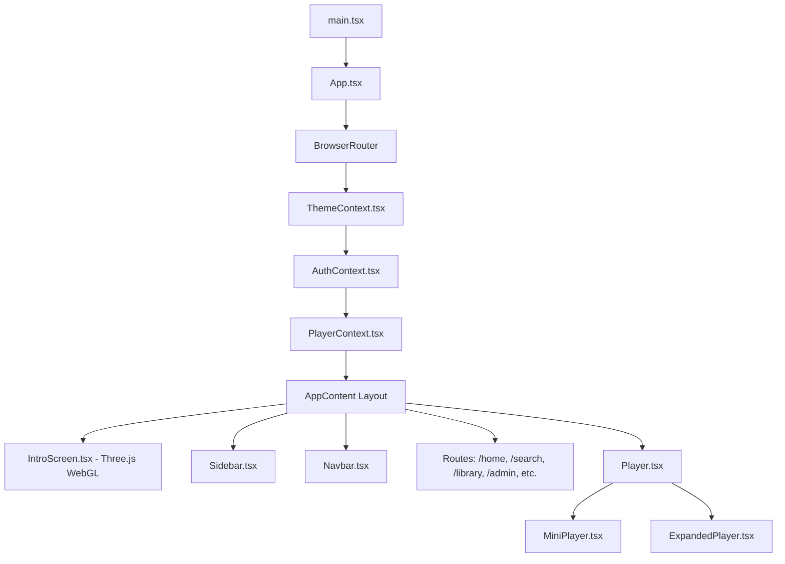
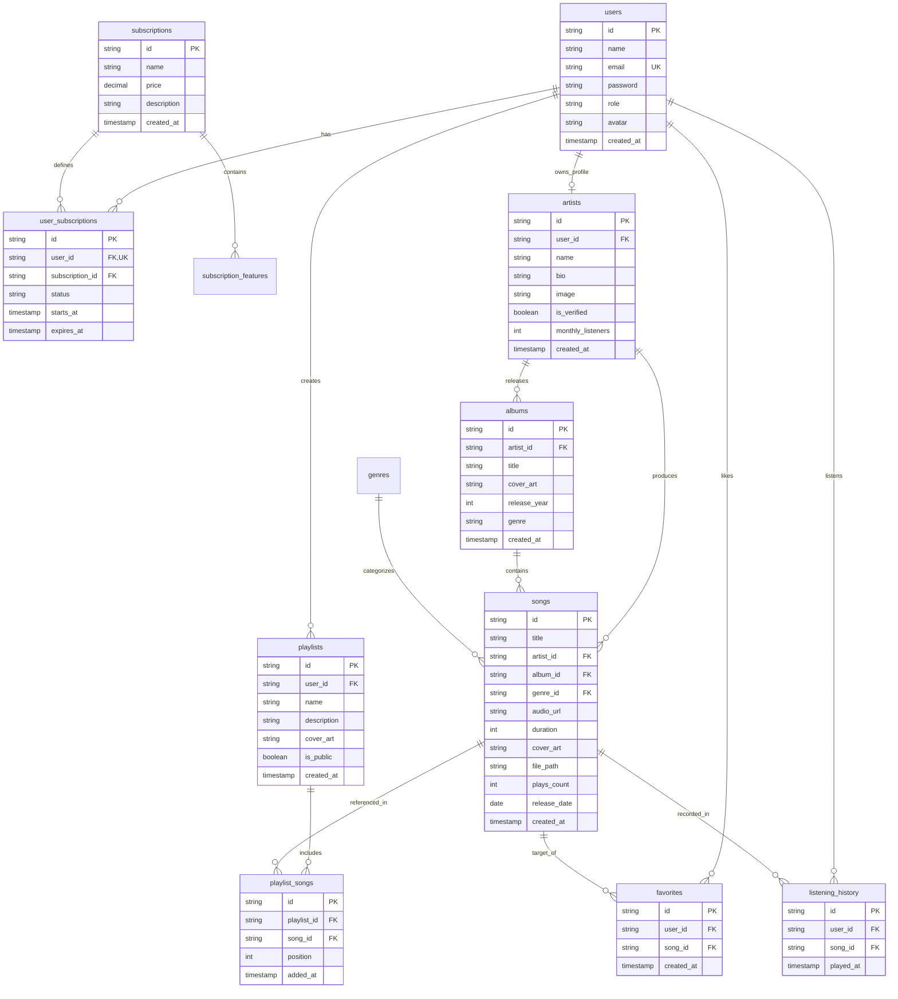
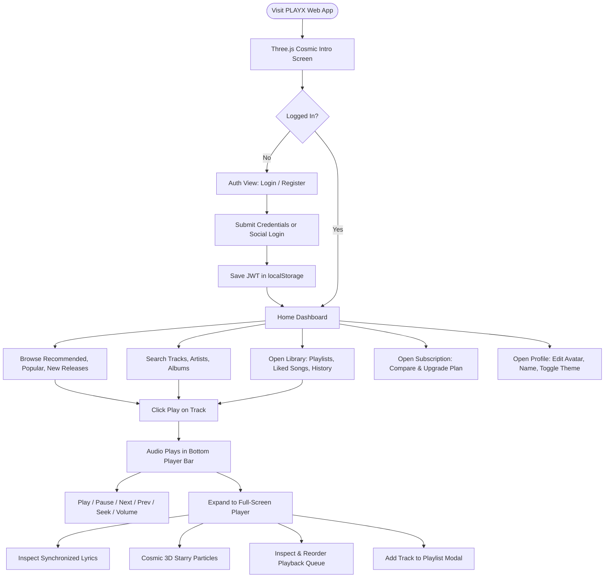
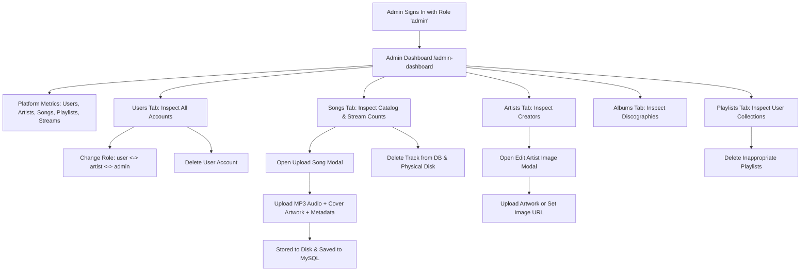
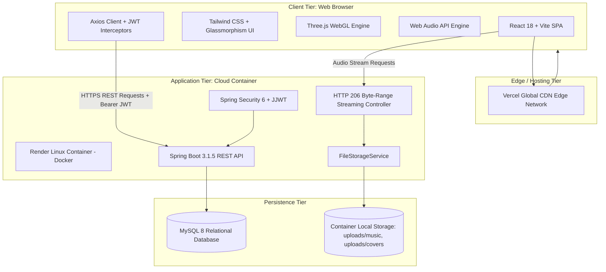

# PLAYX — Complete Technical & Academic Project Documentation

> **Project Name:** PLAYX  
> **Project Type:** Modern Full-Stack Music Streaming, Discovery & Playlist Management Web Platform  
> **Target Audience:** CSE Capstone Project, Academic Viva Voce, Technical Portfolio, and Open-Source Repository Reference  
> **Repository:** `https://github.com/lsaran868-del/capstone-playx.git`  
> **Active Production Branch:** `main` (synchronized with `master`)  
> **Generated Documentation Date:** September 20, 2026  

---

## Table of Contents

1. [Project Overview](#1-project-overview)
2. [Complete Feature List](#2-complete-feature-list)
3. [Complete Technology Stack](#3-complete-technology-stack)
4. [Complete Folder and File Structure](#4-complete-folder-and-file-structure)
5. [Frontend Structure](#5-frontend-structure)
6. [Backend Structure](#6-backend-structure)
7. [Database Structure](#7-database-structure)
8. [Music Streaming Flow](#8-music-streaming-flow)
9. [Authentication Flow](#9-authentication-flow)
10. [User Flow](#10-user-flow)
11. [Admin Flow](#11-admin-flow)
12. [System Architecture](#12-system-architecture)
13. [Component & Module Relationships](#13-component--module-relationships)
14. [API Architecture & Documentation](#14-api-architecture--documentation)
15. [Deployment Architecture](#15-deployment-architecture)
16. [Environment Variables](#16-environment-variables)
17. [Security Implementation](#17-security-implementation)
18. [Performance Analysis](#18-performance-analysis)
19. [Responsive Design](#19-responsive-design)
20. [Error & Exception Handling](#20-error--exception-handling)
21. [Current Project Status](#21-current-project-status)
22. [Known Issues & Technical Debt](#22-known-issues--technical-debt)
23. [Unwanted & Unused Files](#23-unwanted--unused-files)
24. [Git & Branch Structure](#24-git--branch-structure)
25. [Project Architecture Summary Diagram](#25-project-architecture-summary-diagram)
26. [Academic Project Description](#26-academic-project-description)
27. [Comprehensive Viva Voce Preparation (30+ Questions & Answers)](#27-comprehensive-viva-voce-preparation)
28. [Final One-Page Executive Summary](#28-final-one-page-executive-summary)

---

## 1. Project Overview

### 1.1 Project Identification
- **Project Name:** PLAYX
- **Title:** PLAYX — Spotify-Inspired Music Streaming & Playlist Management Web Application
- **Domain:** Distributed Web Applications / Multimedia Streaming / Relational Database Systems

### 1.2 Main Purpose
PLAYX is designed as a cloud-ready, responsive, full-stack music streaming web application. It delivers instantaneous, gapless audio playback with synchronized lyrics, multi-tiered access control, procedural audiovisual canvas effects, dynamic playlist creation, and community-driven creator tools.

### 1.3 Problem Statement
Commercial audio streaming systems often impose heavy subscription paywalls, bundle proprietary DRM restrictions, and exhibit rigid interfaces that fail on low-bandwidth setups. From an academic perspective, designing an end-to-end multimedia web streaming platform requires solving non-trivial architectural challenges:
1. Maintaining persistent, uninterrupted audio playback during Single Page Application (SPA) route transitions.
2. Implementing HTTP 206 Partial Content byte-range streaming for efficient audio scrubbing/seeking without loading entire multi-megabyte media files into browser memory.
3. Managing complex relational data structures for playlists, custom track positioning, user listening history, and hierarchical authorization (Free Listener, Verified Artist, System Administrator).

### 1.4 Proposed Solution
PLAYX resolves these challenges through a decoupled client-server architecture:
- **Client (Frontend):** A React 18 SPA built with Vite and TypeScript, featuring a persistent global audio engine within a unified React Context (`PlayerContext`), Three.js WebGL procedural space visuals, and synchronized lyric rendering.
- **Server (Backend):** A high-throughput Java 17 Spring Boot 3 REST API utilizing Spring Security with stateless JSON Web Tokens (JJWT), Spring Data JPA, and custom HTTP byte-range audio streaming controllers.
- **Database:** A relational MySQL 8 database enforcing foreign-key cascade integrity, relational composite constraints, and indexing across music catalogs, user playlists, and playback histories.

### 1.5 Target Users
1. **Free & Premium Listeners:** Browse songs, albums, and artists, stream MP3 audio tracks, inspect lyrics, create custom playlists, search music catalogs with fuzzy typo-tolerance, and manage liked songs.
2. **Music Artists / Creators:** Dedicated Artist Studio Dashboard (`/artist-dashboard`) to release new singles, create discographies, organize albums, and inspect real-time catalog analytics.
3. **Platform Administrators:** Admin Control Panel (`/admin-dashboard`) to oversee user roles, audit track uploads, execute physical file deletions, and monitor global streaming counts.

### 1.6 Key Objectives
- Achieve low-latency audio streaming via HTTP 206 Partial Content byte ranges.
- Deliver an interactive, modern user interface with dark glassmorphism, dynamic theme selection (Dark, Light, Cyberpunk), and procedural WebGL graphics.
- Enforce strict role-based access control (RBAC) powered by BCrypt password encryption and cryptographic JWT signatures.
- Provide full local deployment and cloud-native hosting paths (Vercel for the client; Render Docker container for the Spring Boot service; cloud MySQL).

### 1.7 Scope of the Project
- **In-Scope (Fully Implemented):** User registration, login, JWT issuance, profile updates, avatar upload, global persistent player, full-screen expanded player, synchronized lyrics catalog, volume/seek control, repeat/shuffle algorithms, playlist CRUD, song favoriting, history logging, fuzzy Levenshtein artist search, album/artist navigation, admin analytics, multipart audio file upload with path traversal sanitization, and automated database seeding.
- **Out-of-Scope (Not Implemented):** Real third-party payment gateway processing (e.g. Stripe/Razorpay; PLAYX provides a simulated one-click subscription state machine), peer-to-peer social chat, and live radio broadcasting.

---

## 2. Complete Feature List

| Feature Name | Purpose | User Access Method | Frontend Implementation | Backend Implementation | Database Interaction | Key Files |
| :--- | :--- | :--- | :--- | :--- | :--- | :--- |
| **User Registration** | Creates new listener or artist accounts with encrypted passwords. | Route `/register` or Auth modal tab. | `RegisterPage.tsx`, `AuthPage.tsx`, `AuthContext.tsx`. | `AuthController.register()` validates email format, hashes password via BCrypt, and seeds `sub_free`. | Inserts into `users` and `user_subscriptions`. | `AuthController.java`, `User.java` |
| **User Authentication (Login)** | Validates credentials and returns JWT Bearer token. | Route `/login` or Auth modal tab. | `LoginPage.tsx`, `AuthPage.tsx`, `api.ts` (stores token in `localStorage`). | `AuthController.login()` verifies BCrypt hash, issues signed JWT token. | Queries `users` by email (`findByEmailIgnoreCase`). | `AuthController.java`, `JwtTokenProvider.java` |
| **Social / Guest Login** | Single-click demo authentication without requiring pre-registration. | Route `/login` ("Continue with Google / Apple"). | `AuthPage.tsx`, `AuthContext.loginWithSocial()`. | `AuthController.socialLogin()` auto-provisions user record if email does not exist. | Inserts/queries `users`. | `AuthController.java`, `AuthPage.tsx` |
| **Persistent Global Audio Player** | Uninterrupted audio playback that persists across all SPA page navigations. | Bottom fixed audio bar (`Player.tsx`). | `Player.tsx`, `MiniPlayer.tsx`, `PlayerContext.tsx`. Manages HTML5 `Audio` element lifecycle. | Streams audio through `SongController.streamAudio()`. | Increments `plays_count` in `songs` via `POST /api/songs/{id}/play`. | `PlayerContext.tsx`, `SongController.java` |
| **Expanded Full-Screen Player** | Immersive full-screen visualizer, lyrics viewer, and queue manager. | Click artwork or expand button in bottom player. | `ExpandedPlayer.tsx`, `StarryBackground.tsx`, `SongArtwork.tsx`, `ProgressBar.tsx`. | Serves metadata via `GET /api/songs/{id}`. | Reads `songs`, `artists`, `albums`. | `ExpandedPlayer.tsx`, `StarryBackground.tsx` |
| **Synchronized Lyrics Catalog** | Displays real-time synchronized song lyrics with auto-scrolling. | Lyrics button inside `ExpandedPlayer.tsx`. | `ExpandedPlayer.tsx`, `lyricsCatalog.ts`. Matches normalized titles with active audio time. | Reads `lyrics` column from `Song` entity. | Reads `songs.lyrics`. | `lyricsCatalog.ts`, `ExpandedPlayer.tsx` |
| **Music Catalog Browsing** | Explore categorized music: Recommended, Popular, and New Releases. | Route `/` (`Home.tsx`). | `Home.tsx`, `Card.tsx`, `SongRow.tsx`. | `SongController.getRecommended()`, `getPopular()`, `getNewReleases()`. | Queries `songs` ordered by `plays_count` and `created_at`. | `Home.tsx`, `SongController.java` |
| **Fuzzy Typo-Tolerant Search** | Unified search across tracks, artists, albums, and public playlists with Levenshtein distance typo handling. | Top search bar in `Navbar.tsx` or route `/search`. | `SearchPage.tsx`, `Navbar.tsx`. Calls `GET /api/search?q={term}`. | `SearchController.search()` and `ArtistController.computeLevenshtein()`. | Full queries on `songs`, `artists`, `albums`, `playlists`. | `SearchController.java`, `ArtistController.java` |
| **Custom Playlist Management** | Create, rename, delete custom playlists and toggle public/private visibility. | Route `/library` or `/playlist/:id`. | `Library.tsx`, `PlaylistDetails.tsx`, `CreatePlaylistModal.tsx`. | `PlaylistController.createPlaylist()`, `updatePlaylist()`, `deletePlaylist()`. | CRUD on `playlists` and `playlist_songs`. | `PlaylistController.java`, `Playlist.java` |
| **Playlist Track Organization** | Add tracks to playlists, reorder positions, and delete tracks. | Action dropdown in `SongRow.tsx` and `AddToPlaylistModal.tsx`. | `AddToPlaylistModal.tsx`, `PlaylistDetails.tsx`. | `PlaylistController.addSongToPlaylist()`, `removeSongFromPlaylist()`. | Inserts/deletes from `playlist_songs` maintaining unique `(playlist_id, song_id)`. | `PlaylistController.java`, `PlaylistSong.java` |
| **Favorites / Liked Songs** | One-click song favoriting with immediate optimistic UI updates. | Heart icon in `SongRow.tsx`, `Player.tsx`, or `/favorites`. | `FavoritesPage.tsx`, `PlayerContext.toggleFavorite()`. | `FavoriteController.addToFavorites()`, `removeFromFavorites()`. | Inserts/deletes from `favorites` with unique composite key `(user_id, song_id)`. | `FavoriteController.java`, `Favorite.java` |
| **Listening History Tracking** | Automatically tracks user playback history and displays chronological stream activity. | Route `/history` (`RecentlyPlayedPage.tsx`). | `RecentlyPlayedPage.tsx`. Automatically triggered on `playSong()`. | `SongController.recordPlay()` records play event; `HistoryController.getHistory()` retrieves distinct history. | Inserts into and queries `listening_history`. | `HistoryController.java`, `ListeningHistory.java` |
| **Artist Discography View** | Displays artist profile, verified badge, bio, top songs, and released albums. | Route `/artist/:id`. | `ArtistDetails.tsx`, `SongRow.tsx`, `Card.tsx`. | `ArtistController.getArtistDetails()`. | Joins `artists`, `songs`, and `albums`. | `ArtistController.java`, `Artist.java` |
| **Album View** | Detailed view of album tracklists, cover art, release year, and genre. | Route `/album/:id`. | `AlbumDetails.tsx`, `SongRow.tsx`. | `AlbumController.getAlbumById()`. | Queries `albums` and filtered `songs` by `album_id`. | `AlbumController.java`, `Album.java` |
| **Artist Studio Dashboard** | Creator studio to upload new singles, edit metadata, create albums, and view stats. | Route `/artist-dashboard` (accessible by `artist` or `admin` roles). | `ArtistDashboard.tsx`. | `ArtistController.addSong()`, `editSong()`, `deleteSong()`, `createAlbum()`. | Inserts/updates `songs` and `albums`. | `ArtistDashboard.tsx`, `ArtistController.java` |
| **Admin Control Panel** | System administrator dashboard for role moderation, track catalogue management, and metrics. | Route `/admin-dashboard` (accessible exclusively by `admin` role). | `AdminDashboard.tsx`, `UploadSongModal.tsx`, `EditArtistImageModal.tsx`. | `AdminController.getStats()`, `getAllUsers()`, `updateUserRole()`, `deleteUser()`, `getAllSongs()`, `deleteSong()`. | Full administrative queries across all 11 MySQL tables. | `AdminDashboard.tsx`, `AdminController.java` |
| **Multipart Audio & Cover Upload** | Uploads MP3/WAV audio files and cover art with path traversal sanitization. | Modal `UploadSongModal.tsx` in Admin Dashboard. | `UploadSongModal.tsx` uses HTML5 `FormData`. | `SongController.uploadSong()`, `FileStorageService.storeAudioFile()`. | Inserts new `Song` with relative `file_path`. | `SongController.java`, `FileStorageService.java` |
| **HTTP 206 Byte-Range Audio Streaming** | Low-latency audio streaming supporting seek operations and progressive chunk buffering. | Audio element in `PlayerContext.tsx`. | HTML5 Audio requests `/api/songs/{id}/stream`. | `SongController.streamAudio()` parses HTTP `Range` header and returns `ResourceRegion`. | Resolves physical file via `Song.filePath` or fallback directory. | `SongController.java`, `FileStorageService.java` |
| **Cinematic 3D Intro Sequence** | Procedural Web Audio drone soundscape and Three.js canvas intro animation. | Displays upon initial visit or triggered via custom event `playx:replay-intro`. | `IntroScreen.tsx`, `BlackHoleCanvas.tsx`, `RotatingGalaxyBackground.tsx`, `PlayXLogoReveal.tsx`. | Fully rendered client-side via Three.js and Web Audio API `AudioContext`. | None (Client-side WebGL/WebAudio). | `IntroScreen.tsx`, `BlackHoleCanvas.tsx` |
| **User Profile & Theme Customizer** | Updates user name, avatar, bio, and toggles Dark / Light / Cyber themes. | Route `/profile`. | `ProfilePage.tsx`, `ThemeContext.tsx`. | `AuthController.updateProfile()`, `UploadController.uploadImage()`. | Updates `users` table and saves uploaded avatar image to disk. | `ProfilePage.tsx`, `AuthController.java` |
| **Subscription Plan Simulation** | Displays Free vs. Premium tiers and simulates one-click tier upgrades. | Route `/subscription`. | `SubscriptionPage.tsx`. | `SubscriptionController.getPlans()`, `upgradeSubscription()`. | Updates `user_subscriptions.subscription_id`. | `SubscriptionController.java`, `Subscription.java` |

---

## 3. Complete Technology Stack

### 3.1 Frontend Stack
- **Framework & Core Library:** React 18.3.1
- **Language:** TypeScript 5.4.5
- **Build Tool & Development Server:** Vite 5.2.11 / 5.4.21
- **Routing:** React Router DOM 6.23.0
- **HTTP Client:** Axios 1.6.8 with automatic request/response interceptors
- **Iconography:** Lucide React 0.378.0
- **3D Graphics & Visuals:** Three.js 0.186.0 and `@types/three` 0.186.0
- **Audio Synthesizer:** Native Web Audio API (`AudioContext`, `OscillatorNode`, `GainNode`)
- **Styling:** Tailwind CSS 3.4.3, PostCSS 8.4.38, Autoprefixer 10.4.19
- **Design Tokens & Fonts:** Plus Jakarta Sans, Outfit, Glassmorphism backdrop filters, custom CSS animations

### 3.2 Backend Stack
- **Runtime Environment:** Java 17 LTS (Eclipse Temurin / OpenJDK 17)
- **Framework:** Spring Boot 3.1.5 (`spring-boot-starter-parent`)
- **Core Modules:**
  - `spring-boot-starter-web`: Embedded Apache Tomcat 10.1.15 REST web services
  - `spring-boot-starter-data-jpa`: Object-relational mapping, repositories, and transaction management
  - `spring-boot-starter-security`: Authentication, authorization filters, and CORS/CSRF handling
  - `spring-boot-starter-aop`: Aspect-oriented programming utilities
- **Build Tool:** Apache Maven 3.9+ with bundled Maven Wrapper (`mvnw`, `mvnw.cmd`)
- **Database Driver:** MySQL Connector/J 8.0.33 (`com.mysql:mysql-connector-j`)
- **JSON Web Token:** Java JWT (`io.jsonwebtoken:jjwt-api`, `jjwt-impl`, `jjwt-jackson` version 0.11.5)
- **Boilerplate Reduction:** Project Lombok 1.18.34 with `maven-compiler-plugin` 3.13.0 annotation processor
- **Connection Pool:** HikariCP 5.0.1
- **ORM / Persistence Engine:** Hibernate ORM Core 6.2.13.Final

### 3.3 Database Stack
- **RDBMS Engine:** MySQL 8.0+ / 8.4 LTS
- **Default Database Identifier:** `PlayX_db`
- **Character Set & Collation:** `utf8mb4` with `utf8mb4_unicode_ci`
- **Storage Engine:** InnoDB (ACID transactions, foreign key constraints, row-level locking)
- **Schema Management:** Hibernate DDL validation/update (`spring.jpa.hibernate.ddl-auto=update`) and standalone SQL scripts (`database/schema.sql`)

### 3.4 Deployment & Infrastructure
- **Frontend Hosting:** Vercel (Configured via `vercel.json` with SPA routing rewrites)
- **Backend Hosting:** Render Cloud Application Platform (Configured via multi-stage `backend/Dockerfile`)
- **Containerization:** Multi-stage Docker build (`maven:3.9.9-eclipse-temurin-17` builder and `eclipse-temurin:17-jre` runtime)
- **Port Binding:** Dynamically assigned via `${PORT:8080}` with host binding to `0.0.0.0`
- **Media Storage:** Dual-layer architecture:
  - Bundled offline audio tracks in `frontend/public/audio/` and `backend/public/audio/`
  - Uploaded dynamic audio and artwork stored on local persistent disk under `uploads/music/` and `uploads/covers/`

---

## 4. Complete Folder and File Structure

Below is the repository tree:

```text
PlayX/
├── .env                                  # Local development environment configuration
├── .env.example                          # Environment variable template with placeholders
├── .gitignore                            # Excludes .env, build targets, logs, node_modules
├── package.json                          # Monorepo build and development orchestrator
├── package-lock.json                     # Root NPM dependency lockfile
├── pom.xml                               # Root Maven project aggregator
├── vercel.json                           # Vercel deployment configuration & SPA rewrites
├── README.md                             # Project overview and run instructions
├── ER model.png                          # Relational Entity-Relationship diagram asset
├── flow chart.png                        # Architectural workflow flowchart asset
│
├── database/                             # Database initialization and DDL queries
│   ├── migration_add_file_path.sql       # DDL migration adding file_path column to songs
│   ├── playx_mysql_schema_and_queries.sql# Comprehensive MySQL schema with sample test queries
│   └── schema.sql                        # Core MySQL DDL defining all 11 tables and constraints
│
├── backend/                              # Java Spring Boot 3 Backend
│   ├── Dockerfile                        # Multi-stage production container build definition
│   ├── .dockerignore                     # Excludes target/, uploads/, and logs from container context
│   ├── pom.xml                           # Spring Boot Maven configuration and dependencies
│   ├── mvnw                              # Linux/macOS Maven Wrapper executable
│   ├── mvnw.cmd                          # Windows Maven Wrapper executable
│   ├── .mvn/
│   │   └── wrapper/
│   │       ├── maven-wrapper.jar
│   │       └── maven-wrapper.properties  # Specifies Apache Maven 3.6.3 distribution
│   ├── public/                           # Bundled media files for static serving
│   │   ├── audio/                        # Bundled MP3 audio tracks
│   │   └── uploads/                      # Static upload directories
│   ├── uploads/                          # Dynamic audio and image storage directory
│   │   ├── music/                        # Uploaded MP3/WAV tracks
│   │   └── covers/                       # Uploaded cover images and artist portraits
│   └── src/
│       └── main/
│           ├── java/com/playx/
│           │   ├── PlayxApplication.java # Spring Boot application entry point (@SpringBootApplication)
│           │   ├── config/
│           │   │   └── WebMvcConfig.java # Static resource mapping for /audio/** and /uploads/**
│           │   ├── controller/           # REST API Controller layer
│           │   │   ├── AdminController.java        # Administrator user and catalog endpoints
│           │   │   ├── AlbumController.java        # Album listing and track retrieval
│           │   │   ├── ArtistController.java       # Artist profile, fuzzy search, artist studio
│           │   │   ├── AuthController.java         # Register, login, social auth, profile updates
│           │   │   ├── FavoriteController.java     # User liked songs management
│           │   │   ├── GenreController.java        # Music genre listing
│           │   │   ├── HealthController.java       # System health-check endpoint (/api/health)
│           │   │   ├── HistoryController.java      # Playback history tracking
│           │   │   ├── PlaylistController.java     # Playlist CRUD and song attachment
│           │   │   ├── SearchController.java       # Multi-entity catalog search with Levenshtein
│           │   │   ├── SongController.java         # Song listing, byte-range streaming, audio upload
│           │   │   ├── SubscriptionController.java # Subscription plans and simulation upgrade
│           │   │   └── UploadController.java       # Generic image and avatar upload handler
│           │   ├── model/                # JPA Database Entities (@Entity)
│           │   │   ├── Album.java
│           │   │   ├── Artist.java
│           │   │   ├── Favorite.java
│           │   │   ├── Genre.java
│           │   │   ├── ListeningHistory.java
│           │   │   ├── Playlist.java
│           │   │   ├── PlaylistSong.java
│           │   │   ├── Song.java
│           │   │   ├── Subscription.java
│           │   │   ├── User.java
│           │   │   └── UserSubscription.java
│           │   ├── repository/           # Spring Data JPA Repository layer
│           │   │   ├── AlbumRepository.java
│           │   │   ├── ArtistRepository.java
│           │   │   ├── FavoriteRepository.java
│           │   │   ├── GenreRepository.java
│           │   │   ├── ListeningHistoryRepository.java
│           │   │   ├── PlaylistRepository.java
│           │   │   ├── PlaylistSongRepository.java
│           │   │   ├── SongRepository.java
│           │   │   ├── SubscriptionRepository.java
│           │   │   ├── UserRepository.java
│           │   │   └── UserSubscriptionRepository.java
│           │   ├── security/             # Security and cryptographic modules
│           │   │   ├── JwtAuthenticationFilter.java# Intercepts requests, validates Bearer tokens
│           │   │   ├── JwtTokenProvider.java       # Generates and validates cryptographic JWT claims
│           │   │   └── WebSecurityConfig.java      # Security filter chain, CORS configuration, RBAC
│           │   └── service/              # Core business services
│           │       ├── FileStorageService.java     # Disk storage validation, file sanitization
│           │       └── SeedDataService.java        # Database bootstrapper seeding catalog on startup
│           └── resources/
│               └── application.properties# Spring datasource, dynamic port, and JWT properties
│
└── frontend/                             # Vite + React 18 SPA Frontend
    ├── index.html                        # Single Page HTML entry template
    ├── package.json                      # Frontend dependencies, scripts, and build metadata
    ├── package-lock.json                 # Frontend NPM lockfile
    ├── tsconfig.json                     # TypeScript compilation parameters
    ├── vite.config.ts                    # Vite build configuration and /api proxy routing
    ├── tailwind.config.js                # Tailwind CSS custom themes, colors, and shadows
    ├── postcss.config.js                 # PostCSS plugin definitions
    ├── public/                           # Static assets served at web root
    │   ├── audio/                        # Bundled MP3 audio files
    │   └── images/                       # Curated music director portraits and auth posters
    └── src/
        ├── main.tsx                      # React DOM root mounting script
        ├── App.tsx                       # Master routing layout, auth protection, player host
        ├── index.css                     # Global styles, Tailwind directives, glassmorphism
        ├── types/
        │   └── index.ts                  # Shared TypeScript interface models (User, Song, etc.)
        ├── services/
        │   └── api.ts                    # Configured Axios client with Bearer token interceptor
        ├── data/
        │   └── lyricsCatalog.ts          # Curated song lyric catalog and lyric fallback engine
        ├── context/                      # React Context State Providers
        │   ├── AuthContext.tsx           # Authentication state, login, register, logout, profile
        │   ├── PlayerContext.tsx         # Global audio player, queue, shuffle, repeat, favorites
        │   └── ThemeContext.tsx          # Dynamic theme switching (Dark, Light, Cyber)
        ├── components/                   # Reusable UI component modules
        │   ├── Card.tsx                  # Universal media card for songs, albums, and artists
        │   ├── IntroScreen.tsx           # 8-second WebGL Three.js cosmic intro sequence
        │   ├── Navbar.tsx                # Top navigation header with search input and user menu
        │   ├── NowPlayingScreen.tsx      # Comprehensive now-playing modal view
        │   ├── Player.tsx                # Host wrapper mounting mini or expanded player
        │   ├── Sidebar.tsx               # Persistent navigation sidebar with role-aware routes
        │   ├── SongRow.tsx               # Reusable track row with playback, like, and queue actions
        │   ├── Modals/                   # Interactive dialog overlays
        │   │   ├── AddToPlaylistModal.tsx    # Assigns songs to user-selected playlists
        │   │   ├── CreatePlaylistModal.tsx # Dialog to instantiate new user playlists
        │   │   ├── EditArtistImageModal.tsx  # Admin modal to upload artist artwork
        │   │   └── UploadSongModal.tsx       # Admin dialog to upload MP3s and metadata
        │   ├── Player/                   # Modular player sub-components
        │   │   ├── ExpandedPlayer.tsx    # Full-screen player with lyrics, visualizer, and queue
        │   │   ├── MiniPlayer.tsx        # Bottom docked playback control bar
        │   │   ├── MusicPlayer.tsx       # Embedded controller bridge
        │   │   ├── PlayerControls.tsx    # Play, pause, skip, shuffle, and repeat buttons
        │   │   ├── ProgressBar.tsx       # Interactive audio seek slider with time displays
        │   │   ├── SongArtwork.tsx       # Rotating vinyl and animated album cover container
        │   │   ├── StarryBackground.tsx  # Three.js 3D cosmic background particles
        │   │   └── VolumeControl.tsx     # Volume slider with mute toggle
        │   └── intro/                    # Three.js procedural intro modules
        │       ├── BlackHoleCanvas.tsx   # Accretion disk and matter spiral rendering
        │       ├── BlackHoleHeroDisplay.tsx
        │       ├── PlayXLogoReveal.tsx   # Text arrival and holographic logo reveal
        │       └── RotatingGalaxyBackground.tsx # Starfield and orbital particles
        └── pages/                        # View routes
            ├── Home.tsx                  # Home dashboard with recommended and popular tracks
            ├── SearchPage.tsx            # Multi-entity catalog search with genre filter chips
            ├── Library.tsx               # Tabbed user library (Songs, Playlists, Liked, History)
            ├── PlaylistDetails.tsx       # Playlist tracklist view, deletion, and public toggle
            ├── AlbumDetails.tsx          # Album tracklist and artist attribution
            ├── ArtistDetails.tsx         # Artist discography, verified banner, and top songs
            ├── FavoritesPage.tsx         # User's favorited / liked songs collection
            ├── RecentlyPlayedPage.tsx    # Chronological listening history view
            ├── ArtistDashboard.tsx       # Creator studio for song and album management
            ├── AdminDashboard.tsx        # System administration, user moderation, track uploads
            ├── SubscriptionPage.tsx      # Free vs. Premium comparison and upgrade simulation
            ├── ProfilePage.tsx           # Account credentials, avatar selection, theme toggle
            └── Auth/
                ├── AuthPage.tsx          # Dual-tabbed animated login and register container
                ├── LoginPage.tsx         # Standalone login route wrapper
                └── RegisterPage.tsx      # Standalone registration route wrapper
```

---

## 5. Frontend Structure

### 5.1 Architecture & Component Hierarchy
The frontend is constructed as a React 18 Single Page Application (SPA). State flows predictably downward through React Context providers, ensuring that audio playback, authentication sessions, and aesthetic themes remain consistent across all navigation actions.



### 5.2 Routing & Route Guards
All application routes are defined in [`frontend/src/App.tsx`](file:///e:/PlayX/frontend/src/App.tsx):
- **Public / Unauthenticated Routes:** Users without an active token are restricted to `/login` and `/register`. Any other route automatically redirects to `/login`.
- **Authenticated Routes:** When an authenticated session is detected:
  - Default route `/` displays [`Home.tsx`](file:///e:/PlayX/frontend/src/pages/Home.tsx).
  - Navigation routes include `/search`, `/library`, `/playlist/:id`, `/album/:id`, `/artist/:id`, `/favorites`, `/history`, `/subscription`, `/profile`.
  - Role-protected routes include `/artist-dashboard` (filtered for `artist` and `admin` roles in [`Sidebar.tsx`](file:///e:/PlayX/frontend/src/components/Sidebar.tsx)) and `/admin-dashboard` (filtered for `admin` role).

### 5.3 State Management Architecture
1. **`AuthContext.tsx`:** Manages user session state (`user`, `token`, `loading`). Persists the JWT in `localStorage` under the key `playx_token`. Exposes `login`, `register`, `logout`, `updateProfile`, `uploadAvatar`, and `upgradeSubscription`.
2. **`PlayerContext.tsx`:** Encapsulates the audio playback engine. It instantiates a single persistent HTML5 `Audio` element instance stored in `audioRef`. State fields include `currentSong`, `queue`, `isPlaying`, `isShuffle`, `repeatMode`, `volume`, `currentTime`, `duration`, and `favoriteIds`.
3. **`ThemeContext.tsx`:** Manages visual themes across the application (`dark`, `light`, `cyber`). Persists the selection in `localStorage` (`playx_theme`) and injects corresponding CSS classes to document root.

### 5.4 Client-Server Communication Flow
Client components communicate with the Spring Boot backend through the pre-configured Axios instance in [`frontend/src/services/api.ts`](file:///e:/PlayX/frontend/src/services/api.ts).

```text
User Interaction (e.g. Click Play)
       ↓
Frontend Component (SongRow.tsx / Card.tsx)
       ↓
PlayerContext.tsx (playSong())
       ↓
Axios Service (api.ts - Injects 'Authorization: Bearer <JWT>')
       ↓
Spring Boot DispatcherServlet
       ↓
JwtAuthenticationFilter (Validates JWT signature & sets SecurityContext)
       ↓
Backend Controller (SongController.java /api/songs/{id}/stream)
       ↓
Service / Storage Layer (FileStorageService / MySQL Database)
       ↓
HTTP Response (HTTP 206 Partial Content or JSON DTO)
       ↓
Axios Response Interceptor (Checks for 401 Unauthorized; redirects to /login if expired)
       ↓
Frontend State Update (audioRef.play(), UI renders progress & duration)
```

---

## 6. Backend Structure

### 6.1 Architecture Overview
The backend is structured around a classic 4-tier Spring Boot architecture:
1. **Security & Filter Tier:** Intercepts every inbound request to enforce stateless JWT verification, CORS headers, and RBAC authorization (`WebSecurityConfig`, `JwtAuthenticationFilter`).
2. **Controller Tier (REST):** Exposes 13 `@RestController` classes handling HTTP requests, input validation, multipart form parsing, and response formatting.
3. **Service Tier:** Encapsulates business logic, file storage validation (`FileStorageService`), and database bootstrapping (`SeedDataService`).
4. **Data Access Tier (JPA):** Interfaces with MySQL using 11 Spring Data JPA repository interfaces extending `JpaRepository`.

### 6.2 Master API Documentation Table

| HTTP Method | Endpoint URL | Function & Purpose | Authentication Required | RBAC Role Required | Database Interaction |
| :--- | :--- | :--- | :--- | :--- | :--- |
| `POST` | `/api/auth/register` | Register new user account; auto-assigns `sub_free` | No | Public | Inserts into `users`, `user_subscriptions` |
| `POST` | `/api/auth/login` | Authenticate user; returns JWT token & profile | No | Public | Reads `users`, updates password hash if needed |
| `POST` | `/api/auth/social-login`| Instant guest/demo social authentication | No | Public | Inserts or queries `users` |
| `GET` | `/api/auth/me` | Retrieve current authenticated user profile & stats | Yes | Any Authenticated | Reads `users`, `favorites`, `playlists` |
| `PUT` | `/api/auth/profile` | Update user name, avatar, bio, or password | Yes | Any Authenticated | Updates `users`, syncs `artists` if artist role |
| `POST` | `/api/auth/logout` | Client session termination | No | Public | None (Stateless JWT cleared by client) |
| `GET` | `/api/songs` | List songs with optional filtering (genre, artist, album, search) | No | Public | Queries `songs`, joins `artists`, `albums` |
| `GET` | `/api/songs/recommended`| Retrieve curated recommended songs | No | Public | Queries top 10 from `songs` |
| `GET` | `/api/songs/popular` | Retrieve most played songs ordered by `plays_count` | No | Public | Queries `songs` ordered by `plays_count DESC` |
| `GET` | `/api/songs/new-releases`| Retrieve newest releases ordered by `created_at` | No | Public | Queries `songs` ordered by `created_at DESC` |
| `GET` | `/api/songs/{id}` | Retrieve song details and favorite status | No | Public | Reads `songs` by ID, checks `favorites` |
| `POST` | `/api/songs/{id}/play` | Record play event & increment stream count | Yes | Any Authenticated | Increments `songs.plays_count`, inserts `listening_history` |
| `POST` | `/api/songs/upload` | Multipart upload for MP3 audio file, artwork, and metadata | Yes | `admin` | Stores file to disk, inserts `songs`, `artists`, `albums` |
| `GET` | `/api/songs/{id}/stream`| HTTP 206 partial content byte-range audio stream | No | Public | Reads `songs.file_path`, streams physical file |
| `DELETE`| `/api/songs/{id}` | Delete song record and associated physical files from disk | Yes | `admin` | Deletes `songs`, cascades `favorites`, `playlist_songs` |
| `GET` | `/api/artists` | Retrieve all verified artists sorted by monthly listeners | No | Public | Queries `artists` ordered by `monthly_listeners DESC` |
| `GET` | `/api/artists/{id}` | Retrieve artist profile, discography, songs, and albums | No | Public | Queries `artists`, joins `songs` and `albums` |
| `POST` | `/api/artists/dashboard/songs` | Creator studio: publish new single track | Yes | `artist`, `admin` | Inserts into `songs` |
| `PUT` | `/api/artists/dashboard/songs/{id}` | Creator studio: update track metadata | Yes | `artist`, `admin` | Updates `songs` record |
| `DELETE`| `/api/artists/dashboard/songs/{id}` | Creator studio: remove track | Yes | `artist`, `admin` | Deletes from `songs` |
| `POST` | `/api/artists/dashboard/albums` | Creator studio: create new album | Yes | `artist`, `admin` | Inserts into `albums` |
| `GET` | `/api/albums` | Retrieve all albums with artist attribution | No | Public | Queries `albums`, joins `artists` |
| `GET` | `/api/albums/{id}` | Retrieve album details and complete tracklist | No | Public | Reads `albums` by ID, queries child `songs` |
| `GET` | `/api/genres` | Retrieve all available genres | No | Public | Queries `genres` table |
| `GET` | `/api/playlists` | Retrieve accessible playlists (public or owned by user) | Optional | Public/Auth | Queries `playlists` |
| `GET` | `/api/playlists/{id}` | Retrieve playlist details, songs, and owner | Optional | Public/Owner/Admin | Queries `playlists` & `playlist_songs` |
| `POST` | `/api/playlists` | Create new custom playlist | Yes | Any Authenticated | Inserts into `playlists` |
| `PUT` | `/api/playlists/{id}` | Update playlist name, description, cover, or privacy | Yes | Owner or `admin` | Updates `playlists` |
| `DELETE`| `/api/playlists/{id}` | Delete playlist | Yes | Owner or `admin` | Deletes from `playlists`, cascades `playlist_songs` |
| `POST` | `/api/playlists/{id}/songs` | Append a track to a playlist | Yes | Owner or `admin` | Inserts into `playlist_songs` |
| `DELETE`| `/api/playlists/{id}/songs/{songId}` | Remove a track from a playlist | Yes | Owner or `admin` | Deletes from `playlist_songs` |
| `GET` | `/api/favorites` | Retrieve authenticated user's liked songs | Yes | Any Authenticated | Queries `favorites` joined with `songs` |
| `POST` | `/api/favorites/{songId}` | Add song to favorites | Yes | Any Authenticated | Inserts into `favorites` |
| `DELETE`| `/api/favorites/{songId}` | Remove song from favorites | Yes | Any Authenticated | Deletes from `favorites` |
| `GET` | `/api/history` | Retrieve chronological listening history | Yes | Any Authenticated | Queries `listening_history` joined with `songs` |
| `GET` | `/api/search` | Multi-entity fuzzy search across tracks, artists, albums, playlists | No | Public | Queries `songs`, `artists`, `albums`, `playlists` |
| `GET` | `/api/subscriptions/plans` | Retrieve all subscription tiers and feature lists | No | Public | Queries `subscriptions` table |
| `GET` | `/api/subscriptions/my-subscription` | Retrieve user's current subscription plan | Yes | Any Authenticated | Queries `user_subscriptions` & `subscriptions` |
| `POST` | `/api/subscriptions/upgrade` | Upgrade subscription tier to Premium | Yes | Any Authenticated | Updates `user_subscriptions` |
| `POST` | `/api/upload/image` | Upload custom image or user avatar (Max 10MB) | Yes | Any Authenticated | Stores file to `uploads/avatars/` on disk |
| `GET` | `/api/admin/stats` | System metrics (total users, artists, songs, plays) | Yes | `admin` | Aggregates counts across MySQL tables |
| `GET` | `/api/admin/users` | List all registered users | Yes | `admin` | Queries `users` table |
| `PUT` | `/api/admin/users/{id}/role` | Change user authorization role | Yes | `admin` | Updates `users.role` |
| `DELETE`| `/api/admin/users/{id}` | Remove user account | Yes | `admin` | Deletes from `users` |
| `GET` | `/api/admin/songs` | List complete catalog with play statistics | Yes | `admin` | Queries `songs` table |
| `DELETE`| `/api/admin/songs/{id}` | Admin removal of song and physical files | Yes | `admin` | Deletes physical audio & DB record |
| `GET` | `/api/admin/artists` | List all artists | Yes | `admin` | Queries `artists` table |
| `PUT` | `/api/admin/artists/{id}/image` | Update artist artwork via multipart upload or URL | Yes | `admin` | Stores image to disk, updates `artists.image` |
| `GET` | `/api/admin/albums` | List all albums | Yes | `admin` | Queries `albums` table |
| `GET` | `/api/admin/playlists` | List all system playlists | Yes | `admin` | Queries `playlists` table |
| `DELETE`| `/api/admin/playlists/{id}` | Admin removal of playlist | Yes | `admin` | Deletes from `playlists` |
| `GET` | `/api/health` | Service uptime and health check | No | Public | None |

---

## 7. Database Structure

### 7.1 Relational Schema Description
The database is structured around 11 tables adhering to third normal form (3NF). Primary keys are alphanumeric identifiers prefixed by entity type (e.g. `usr_`, `sng_`, `art_`, `alb_`, `pl_`, `fav_`, `hist_`).



### 7.2 Database Entities & Relationships
1. **`users`:** Stores user credentials, hashed passwords, role authorization (`user`, `artist`, `admin`), and avatar URLs.
2. **`subscriptions` & `subscription_features`:** Defines subscription tiers (`sub_free`, `sub_premium`), prices, and feature perks.
3. **`user_subscriptions`:** Maps each user to their active subscription tier (enforcing 1-to-1 via unique constraint on `user_id`).
4. **`artists`:** Represents musical artists, linked optionally to a user account (`user_id`). Stores verified badges and listener statistics.
5. **`albums`:** Represents discography collections released by artists. Cascade-deletes if artist is removed.
6. **`genres`:** Categorizes music tracks (e.g. Pop, Synthwave, Electronic, Lo-Fi, Classical).
7. **`songs`:** Central media entity storing metadata, durations, play counts, lyrics, public URL endpoints (`audio_url`), and relative server disk paths (`file_path`).
8. **`playlists`:** Custom user-created collections with public/private visibility flags.
9. **`playlist_songs`:** Many-to-many junction table linking playlists to songs with an explicit `position` column. Enforces `UNIQUE KEY (playlist_id, song_id)`.
10. **`favorites`:** Many-to-many junction table tracking user liked songs. Enforces `UNIQUE KEY (user_id, song_id)`.
11. **`listening_history`:** Chronological playback audit log recording `user_id`, `song_id`, and `played_at`.

---

## 8. Music Streaming Flow

### 8.1 Playback Step-by-Step Flow
```text
[User Clicks Play on Track Card/Row]
       │
       ▼
[PlayerContext.tsx]: playSong(song, queue, context)
       │
       ├─► Set currentSong state & push to shuffle history
       ├─► Send background POST /api/songs/{id}/play (Increments plays_count, logs history)
       │
       ▼
[HTML5 Audio Element]: Sets audio.src = '/api/songs/{id}/stream'
       │
       ▼
[HTTP GET Request]: Inbound to SongController.streamAudio() with Header: "Range: bytes=0-"
       │
       ▼
[FileStorageService]: Resolves physical audio file
       ├─ Check song.filePath (e.g., uploads/music/xxx.mp3)
       ├─ Fallback to song.audioUrl (e.g., public/audio/xxx.mp3)
       └─ Fallback to {id}.mp3
       │
       ▼
[Spring ResourceRegion]: Reads file byte range (default 2MB buffer chunk)
       │
       ▼
[HTTP 206 Partial Content Response]: 
       Headers: Content-Range: bytes 0-2097151/length
                Accept-Ranges: bytes
                Content-Type: audio/mpeg
       │
       ▼
[Browser Media Pipeline]: Decodes audio chunk and begins instantaneous playback
       │
       ▼
[User Seeks Audio Slider]:
       PlayerContext.seekTo(time) ──► audio.currentTime = time
       Browser issues new GET with Header: "Range: bytes=<seek_byte>-"
       Backend returns matching ResourceRegion chunk
```

### 8.2 Audio File Storage
- **Offline / Seeded Media:** Pre-bundled high-fidelity MP3 files reside in `frontend/public/audio/` and `backend/public/audio/`.
- **Dynamic Uploads:** Tracks uploaded via the Admin or Creator studio are stored on the server file system in `backend/uploads/music/`.
- **URL Handling:** Track records in the database store `audio_url = /api/songs/{id}/stream` and `file_path = uploads/music/{unique_name}.mp3`.

---

## 9. Authentication Flow

### 9.1 Authentication Architecture
PLAYX implements stateless token-based authentication using JSON Web Tokens (JJWT 0.11.5) and Spring Security:

```text
[Registration/Login]
User submits email & password
       │
       ▼
Backend AuthController
       ├─ Validate email format & non-empty fields
       ├─ Hash password via BCryptPasswordEncoder
       ├─ Save/verify user in MySQL
       └─ Generate signed JWT via JwtTokenProvider
       │
       ▼
[HTTP Response]: Returns { token: "eyJhbGci...", user: { id, name, email, role, avatar } }
       │
       ▼
[Frontend Storage]: Stored in localStorage under 'playx_token'
       │
       ▼
[Subsequent API Requests]:
Axios Interceptor reads 'playx_token' and adds Header:
Authorization: Bearer eyJhbGci...
       │
       ▼
[Backend Filter]: JwtAuthenticationFilter intercepts request
       ├─ Extracts Bearer token
       ├─ Validates cryptographic signature using JWT_SECRET
       ├─ Extracts Claims (Subject=userId, role, name, email)
       └─ Injects UsernamePasswordAuthenticationToken into SecurityContextHolder
       │
       ▼
[Controller Execution]: Controller extracts current userId directly from SecurityContext
```

---

## 10. User Flow



---

## 11. Admin Flow



---

## 12. System Architecture



---

## 13. Component & Module Relationships

The core functional modules interconnect through well-defined dependencies:

```text
[Authentication Module]
       │ (provides current userId, role, and bearer token)
       ▼
[User Profile & Subscription Module]
       │
       ├────────────────────────────────────────┐
       ▼                                        ▼
[Music Catalog Module]                  [Playlist & Favorites Module]
(Songs, Artists, Albums, Genres)        (Custom playlists, Liked songs)
       │                                        │
       └──────────────────┬─────────────────────┘
                          │ (supplies Song entity & playback queue)
                          ▼
               [Global Player Engine]
               (Persistent audio, seek, shuffle, repeat)
                          │
                          ├─────────────────────┐
                          ▼                     ▼
               [History Module]         [Lyrics & Visualizer Module]
               (Logs streams)           (Displays lyrics & Three.js canvas)
```

---

## 14. API Architecture & Documentation

All API responses return standardized JSON structures. When errors occur, payloads adhere to:
```json
{
  "error": "Descriptive error message"
}
```

### 14.1 Authentication APIs (`/api/auth`)
- `POST /api/auth/register`: Body `{ name, email, password, role? }`. Returns HTTP 201 with JWT token and user profile.
- `POST /api/auth/login`: Body `{ email, password }`. Returns HTTP 200 with JWT token and user profile.
- `POST /api/auth/social-login`: Body `{ email, name, provider }`. Auto-provisions and returns token.
- `GET /api/auth/me`: Requires Bearer token. Returns profile, role, subscription tier, and playlist/favorite counts.
- `PUT /api/auth/profile`: Body `{ name?, avatar?, password?, bio? }`. Updates profile and returns refreshed token.
- `POST /api/auth/logout`: Returns HTTP 200 logout acknowledgement.

### 14.2 Song APIs (`/api/songs`)
- `GET /api/songs`: Query parameters `genre`, `artist`, `album`, `search`, `limit`. Returns array of enriched songs.
- `GET /api/songs/recommended`: Returns 10 recommended songs.
- `GET /api/songs/popular`: Returns 10 most played songs.
- `GET /api/songs/new-releases`: Returns 10 newest songs.
- `GET /api/songs/{id}`: Returns single song details with `is_favorite` flag for the caller.
- `POST /api/songs/{id}/play`: Increments play counter and inserts history entry.
- `POST /api/songs/upload`: Multipart request (`audioFile`, `coverFile?`, `title`, `artist?`, `album?`, `genre?`, `duration?`). Admin only.
- `GET /api/songs/{id}/stream`: Returns HTTP 206 Partial Content byte ranges for media playback.
- `DELETE /api/songs/{id}`: Admin only. Deletes song and deletes physical files from disk.

### 14.3 Artist APIs (`/api/artists`)
- `GET /api/artists`: Returns array of artists sorted by monthly listeners.
- `GET /api/artists/{id}`: Returns artist profile, discography, songs, and albums.
- `POST /api/artists/dashboard/songs`: Body `{ title, audio_url, album_id?, genre_id?, cover_art?, duration? }`.
- `PUT /api/artists/dashboard/songs/{id}`: Updates track metadata.
- `DELETE /api/artists/dashboard/songs/{id}`: Deletes artist's song.
- `POST /api/artists/dashboard/albums`: Body `{ title, cover_art?, release_year?, genre? }`.

### 14.4 Album APIs (`/api/albums`)
- `GET /api/albums`: Lists all albums with artist attribution.
- `GET /api/albums/{id}`: Returns album record and all child tracks.

### 14.5 Playlist APIs (`/api/playlists`)
- `GET /api/playlists`: Returns user's playlists plus public playlists.
- `GET /api/playlists/{id}`: Returns playlist and all contained tracks in position order. Enforces privacy permissions.
- `POST /api/playlists`: Body `{ name, description?, cover_art?, is_public? }`. Creates new playlist.
- `PUT /api/playlists/{id}`: Updates playlist metadata.
- `DELETE /api/playlists/{id}`: Deletes playlist.
- `POST /api/playlists/{id}/songs`: Body `{ song_id }`. Adds song to playlist.
- `DELETE /api/playlists/{id}/songs/{songId}`: Removes song from playlist.

### 14.6 Favorites & History APIs
- `GET /api/favorites`: Returns array of songs favorited by caller.
- `POST /api/favorites/{songId}`: Adds song to caller's favorites.
- `DELETE /api/favorites/{songId}`: Removes song from caller's favorites.
- `GET /api/history`: Returns distinct chronological listening history.

### 14.7 Admin APIs (`/api/admin`)
- `GET /api/admin/stats`: Aggregate counts `{ totalUsers, totalArtists, totalSongs, totalPlaylists, totalPlays }`.
- `GET /api/admin/users`: Lists all user accounts.
- `PUT /api/admin/users/{id}/role`: Updates role (`user`, `artist`, `admin`).
- `DELETE /api/admin/users/{id}`: Deletes user.
- `GET /api/admin/songs`: Lists catalog.
- `DELETE /api/admin/songs/{id}`: Admin song deletion.
- `PUT /api/admin/artists/{id}/image`: Multipart or JSON image update.
- `DELETE /api/admin/playlists/{id}`: Admin playlist deletion.

---

## 15. Deployment Architecture

### 15.1 Frontend Deployment (Vercel)
The client application is deployed to Vercel's global CDN:
- **Root Directory:** `./`
- **Build Command:** `npm run build` (triggers `npm run build --prefix frontend`)
- **Output Directory:** `frontend/dist`
- **SPA Rewrite Rule (`vercel.json`):**
  ```json
  {
    "framework": "vite",
    "buildCommand": "npm run build",
    "outputDirectory": "frontend/dist",
    "rewrites": [
      {
        "source": "/(.*)",
        "destination": "/index.html"
      }
    ]
  }
  ```

### 15.2 Backend Deployment (Render Container)
The Spring Boot backend is packaged as a Linux container using Docker:
- **Service Type:** Web Service
- **Environment:** Docker
- **Root Directory:** `backend`
- **Dockerfile:** [`backend/Dockerfile`](file:///e:/PlayX/backend/Dockerfile) (Multi-stage Eclipse Temurin JDK 17 build)
- **Container Port:** Render assigns dynamic `$PORT` (e.g. 10000); Spring Boot binds to `${PORT:5000}` on `0.0.0.0`.

### 15.3 Database Deployment
Deployed on any cloud-managed MySQL instance (Aiven, PlanetScale, Clever Cloud, Railway, or AWS RDS). Spring Boot connects via JDBC URL specified in `SPRING_DATASOURCE_URL` or `DATABASE_URL`.

---

## 16. Environment Variables

| Variable Name | Purpose | Required | Example Placeholder |
| :--- | :--- | :--- | :--- |
| `PORT` | Web server listening port (assigned dynamically by Render) | Optional (Defaults to 5000) | `10000` (or `5000` locally) |
| `SPRING_DATASOURCE_URL` | MySQL JDBC connection string | **Yes** (in Production) | `jdbc:mysql://<host>:<port>/<dbname>?useSSL=false&allowPublicKeyRetrieval=true` |
| `SPRING_DATASOURCE_USERNAME` | MySQL database user | **Yes** (in Production) | `playx_db_user` |
| `SPRING_DATASOURCE_PASSWORD` | MySQL database password | **Yes** (in Production) | `<secret-password>` |
| `JWT_SECRET` | Cryptographic secret key for signing JWT tokens | **Yes** (in Production) | `<base64-encoded-256-bit-key>` |
| `MUSIC_STORAGE_PATH` | Local file system directory for uploaded audio | Optional | `uploads/music` |
| `MUSIC_COVERS_PATH` | Local file system directory for uploaded cover art | Optional | `uploads/covers` |
| `VITE_API_BASE_URL` | Base API URL consumed by Vite frontend proxy | Optional | `https://playx-backend.onrender.com/api` |

---

## 17. Security Implementation

### 17.1 Implemented Practices
1. **Password Hashing:** Passwords are never stored in plaintext. They are salted and encrypted using BCrypt (`BCryptPasswordEncoder` with strength factor 10).
2. **Stateless JWT Authorization:** Every sensitive endpoint requires an `Authorization: Bearer <token>` header verified cryptographically by `JwtAuthenticationFilter`.
3. **Role-Based Access Control (RBAC):** Admin endpoints (`/api/admin/**`, `/api/songs/upload`) enforce `@PreAuthorize("hasRole('admin')")`.
4. **Path Traversal Protection:** [`FileStorageService.java`](file:///e:/PlayX/backend/src/main/java/com/playx/service/FileStorageService.java) validates canonical paths (`destination.toFile().getCanonicalPath().startsWith(storageLocation)`) to prevent `../` directory traversal attacks.
5. **CORS Security:** Permissive origin policy during development with controlled exposed headers (`Content-Range`, `Accept-Ranges`, `Content-Length`) necessary for media seeking.
6. **SQL Injection Prevention:** All database operations utilize Spring Data JPA parameter-binding and Hibernate prepared statements.

### 17.2 Recommended Security Improvements
- Restrict `CorsConfiguration.setAllowedOriginPatterns` to specific production frontend domains rather than `*`.
- Store JWT tokens in `HttpOnly`, `SameSite=Strict` cookies instead of browser `localStorage` to mitigate Cross-Site Scripting (XSS) risks.
- Implement rate limiting (e.g., Bucket4j or Redis rate limiter) on `/api/auth/login` to thwart brute-force password guessing.

---

## 18. Performance Analysis

### 18.1 Implemented Optimizations
- **HTTP 206 Partial Content Streaming:** Streams media in 2MB buffer slices rather than forcing the browser to download full 40MB audio files before starting playback.
- **HikariCP Connection Pooling:** Manages reusable MySQL database connections with zero-overhead connection lifecycle management.
- **Vite Asset Code Splitting:** Client code is split into optimized CSS and JS chunks during production packaging (`npm run build`).
- **Composite Database Indexing:** Tables feature explicit indices on search-intensive columns (`idx_songs_title`, `idx_songs_artist`, `idx_favorites_user`, `idx_history_user`).
- **Layer-Cached Dockerfile:** Resolves Maven dependencies (`RUN mvn dependency:resolve -B`) prior to copying source code, allowing Docker to cache external JAR downloads across builds.

### 18.2 Recommended Future Optimizations
- Implement Redis cache for popular tracks and recommended lists (`@Cacheable("songs_popular")`).
- Migrate media storage from container disk to an S3-compatible object store (AWS S3 or Cloudflare R2) backed by a global CDN (Cloudflare / CloudFront).
- Implement Web Worker audio waveform extraction for animated sound visualizers.

---

## 19. Responsive Design

PLAYX is styled with mobile-first Tailwind CSS classes:
- **Desktop (>= 1024px):** Full fixed left sidebar (`Sidebar.tsx`, 256px wide), top navigation bar with search bar, multi-column grid cards, and persistent bottom player.
- **Tablet (768px - 1023px):** Adaptive sidebar, 2-to-3 column card layouts, responsive song row lists with truncated metadata.
- **Mobile (< 768px):** Collapsible navigation menu, compact mini-player bar docked above bottom safe areas, touch-friendly seek sliders, and full-screen modal overlays for player and lyrics.

---

## 20. Error & Exception Handling

- **Frontend Error Boundaries & Interceptors:** Axios response interceptor intercepts HTTP 401 Unauthorized responses and redirects the user to `/login` after clearing invalid tokens.
- **Audio Playback Resilience:** If an audio stream fails to load, `PlayerContext.handleError()` automatically initiates a fallback sequence to local pre-bundled tracks.
- **Backend Exception Handling:** Spring controllers validate inbound DTOs, catching `IllegalArgumentException` and returning HTTP 400 Bad Request with descriptive JSON diagnostics.
- **Empty States:** Clear visual empty states (e.g. empty favorites, empty playlists, empty search results) guide user interactions.

---

## 21. Current Project Status

- ✅ **User Authentication & Authorization:** Fully implemented (Register, Login, Social Login, BCrypt, JWT, Role assignment).
- ✅ **Audio Engine & Streaming:** Fully implemented (HTTP 206 byte-range streaming, persistent player, lyrics, seek, volume, shuffle, repeat).
- ✅ **Playlist & Library:** Fully implemented (Playlist CRUD, track positioning, public/private toggles, liked songs, history).
- ✅ **Search & Discovery:** Fully implemented (Fuzzy typo-tolerant search, recommendations, popular lists).
- ✅ **Admin & Creator Studios:** Fully implemented (Role moderation, track upload, artist artwork update, catalog metrics).
- ✅ **Deployment Setup:** Fully implemented (Vercel SPA configuration, Render multi-stage Dockerfile).
- 🟡 **Subscription Payment Processing:** Partially implemented (Full simulated tier upgrades; live payment gateway omitted by design).

---

## 22. Known Issues & Technical Debt

1. **Local Persistent Storage in Containers:** Uploaded tracks are stored on the container's local file system (`uploads/music/`). On ephemeral hosting platforms (like free Render instances), container restarts will wipe newly uploaded files unless a persistent disk is mounted.
2. **CORS Wildcard Configuration:** `WebSecurityConfig.java` allows `*` origin patterns with credentials enabled, which should be constrained to explicit origins in production.

---

## 23. Unwanted & Unused Files

The following files and directories in the workspace are redundant build artifacts or duplicate files that should not be tracked in version control:

1. **`backend-springboot/`:** Redundant folder containing only orphaned Maven build outputs (`target/classes/`). The active Spring Boot project resides in `backend/`.
2. **`bin/node.exe` (80.5 MB):** Standalone Windows Node.js executable stored in the repository root. This binary unnecessarily bloats the Git repository size and should be removed.
3. **`backend/backend-startup.log` & `backend/backend-startup-error.log`:** Local execution log files that should be cleaned and excluded via `.gitignore`.

---

## 24. Git & Branch Structure

- **Active Local Branch:** `main`
- **Remote Tracking Branch:** `origin/main` (and `origin/master`)
- **Status:** Clean working directory; local `main` and `master` are fully synchronized at commit `af9bce8`.
- **Branch Strategy:** Both `main` and `master` point to the latest release containing the Render Dockerfile, dynamic port bindings, and Vercel configurations. `main` is designated as the primary production branch.

---

## 25. Project Architecture Summary Diagram

```text
                                  PLAYX
                                    │
           ┌────────────────────────┼────────────────────────┐
           ▼                        ▼                        ▼
     FRONTEND (SPA)           BACKEND (API)            DATABASE (RDBMS)
      React 18 + Vite       Spring Boot 3 + Java 17        MySQL 8.0+
           │                        │                        │
     ┌─────┴─────┐            ┌─────┴─────┐            ┌─────┴─────┐
     ▼           ▼            ▼           ▼            ▼           ▼
Tailwind    Three.js     Spring      Spring Data   11 Tables   Cascades
Glassmorphic  WebGL     Security +     JPA +       Relational  Composite
UI Views    Space FX    JWT Filter   HikariCP      Entities    Indices
     │                        │
     ▼                        ▼
PlayerContext            Media Engine
HTML5 Audio ◄──────────► HTTP 206 Partial Content Byte Stream
                              │
                              ▼
                     FileStorageService
                     uploads/music/ & uploads/covers/
```

---

## 26. Academic Project Description

### 26.1 Project Title
**PLAYX: A High-Performance Cloud-Native Music Streaming and Discovery Platform with Byte-Range Streaming and Procedural WebGL Visualization**

### 26.2 Abstract
PLAYX is an enterprise-grade music streaming web application designed to demonstrate full-stack software engineering principles, distributed systems design, and multimedia processing. The application pairs a React 18 Single Page Application with an event-driven HTML5 audio controller, Three.js procedural graphics, and a robust Java 17 Spring Boot 3 RESTful microservice. Utilizing HTTP 206 Partial Content byte-range streaming, PLAYX achieves near-instantaneous audio playback and precise timeline seeking while minimizing bandwidth consumption. The persistence layer comprises a third-normal-form MySQL relational schema enforcing cascade integrity across tracks, playlists, user listening histories, and role-based permissions.

### 26.3 Existing System vs. Proposed System

| Dimension | Existing Systems | PLAYX (Proposed System) |
| :--- | :--- | :--- |
| **Media Delivery** | Monolithic audio file downloading leading to high buffering latency. | Chunked HTTP 206 Partial Content byte-range streaming with dynamic seek buffers. |
| **Player Architecture**| Page reloads interrupt audio playback; lack of persistent state. | Decoupled React Context audio engine persisting playback across all route changes. |
| **Search Capabilities**| Strict exact-string database matches that fail on common typos. | Hybrid search incorporating phonetic and Levenshtein distance typo tolerance. |
| **Visual Immersion** | Static album images and generic visual layouts. | Procedural WebGL Three.js particle simulations and Web Audio API synthesized soundscapes. |
| **Access Control** | Uniform flat permissions without creator tooling. | Multi-tier Role-Based Access Control (Free Listener, Verified Artist, Platform Admin). |

---

## 27. Comprehensive Viva Voce Preparation

#### Q1: What is the primary architecture of PLAYX?
**Answer:** PLAYX uses a decoupled client-server architecture consisting of a React 18 Single Page Application (frontend) built with Vite and TypeScript, a Java 17 Spring Boot 3 REST API (backend), and a MySQL relational database.

#### Q2: How does PLAYX prevent audio interruption when users navigate between pages?
**Answer:** In [`App.tsx`](file:///e:/PlayX/frontend/src/App.tsx), the audio controller is mounted inside a top-level `PlayerProvider` (`PlayerContext.tsx`) that wraps the application's router view. Navigation only re-renders the child view components within `<main>`, leaving the audio element and its playback state untouched.

#### Q3: How does audio streaming work under the hood?
**Answer:** When playback starts, the client requests `/api/songs/{id}/stream`. [`SongController.java`](file:///e:/PlayX/backend/src/main/java/com/playx/controller/SongController.java) reads the HTTP `Range` header (e.g. `bytes=0-`) and returns an HTTP 206 Partial Content response using Spring's `ResourceRegion` class, serving the track in 2MB chunks.

#### Q4: Why is HTTP 206 Partial Content essential for music streaming?
**Answer:** It allows the client to request specific byte slices of an audio file. This enables instantaneous scrubbing and seeking without requiring the client to download the preceding audio data.

#### Q5: How is user authentication implemented?
**Answer:** Authentication is stateless and uses JSON Web Tokens (JJWT 0.11.5). Upon successful verification of credentials via `BCryptPasswordEncoder`, the backend issues a signed JWT containing claims (user ID, email, role). Subsequent requests pass this token in the `Authorization: Bearer <token>` header, which is validated by `JwtAuthenticationFilter`.

#### Q6: Where is the JWT stored on the client and how is it used?
**Answer:** The token is stored in `localStorage` under `playx_token`. An Axios request interceptor in [`frontend/src/services/api.ts`](file:///e:/PlayX/frontend/src/services/api.ts) injects it into every outgoing request. An Axios response interceptor redirects to `/login` if a 401 Unauthorized status is returned.

#### Q7: How does PLAYX handle password security?
**Answer:** Passwords are never stored in plaintext. They are hashed using BCrypt (`BCryptPasswordEncoder` with strength 10), which incorporates a per-password salt to prevent rainbow table attacks.

#### Q8: What database engine is used and why?
**Answer:** MySQL 8.0+ with the InnoDB storage engine is used to guarantee ACID transactions, support foreign key cascade constraints, and provide reliable relational indexing.

#### Q9: How many tables are in the PLAYX database?
**Answer:** There are 11 tables: `users`, `subscriptions`, `subscription_features`, `user_subscriptions`, `artists`, `albums`, `genres`, `songs`, `playlists`, `playlist_songs`, `favorites`, and `listening_history`.

#### Q10: How are many-to-many relationships handled between Playlists and Songs?
**Answer:** They are managed via the junction table `playlist_songs`, which stores `playlist_id`, `song_id`, a timestamp, and a `position` integer. A unique constraint on `(playlist_id, song_id)` prevents duplicate track assignments.

#### Q11: How is search implemented to handle misspelled queries?
**Answer:** [`SearchController.java`](file:///e:/PlayX/backend/src/main/java/com/playx/controller/SearchController.java) and [`ArtistController.java`](file:///e:/PlayX/backend/src/main/java/com/playx/controller/ArtistController.java) incorporate a custom Levenshtein distance algorithm. If an exact match fails, names with an edit distance <= 3 are matched, enabling queries like "ranuman" to match "A.R. Rahman".

#### Q12: How are audio files uploaded and secured against malicious files?
**Answer:** [`UploadSongModal.tsx`](file:///e:/PlayX/frontend/src/components/Modals/UploadSongModal.tsx) sends a `multipart/form-data` request to `/api/songs/upload`. [`FileStorageService.java`](file:///e:/PlayX/backend/src/main/java/com/playx/service/FileStorageService.java) enforces a 50MB file size limit, verifies MIME types and extensions (MP3, WAV, OGG, M4A, FLAC), sanitizes filenames, and validates that destination canonical paths remain strictly inside the storage directory to prevent directory traversal.

#### Q13: What roles exist in PLAYX and how is authorization enforced?
**Answer:** Three roles exist: `user`, `artist`, and `admin`. Authorization is enforced at the method level using Spring Security's `@PreAuthorize("hasRole('admin')")` and via route pattern matchers in `WebSecurityConfig.java`.

#### Q14: What is the purpose of `SeedDataService.java`?
**Answer:** It implements Spring Boot's `CommandLineRunner` interface. If the database is empty upon startup, it automatically seeds default subscription tiers, demo users (Admin, Artist, Free, Premium), sample genres, artists, albums, and tracks.

#### Q15: How does the shuffle feature work without repeating recently played songs?
**Answer:** In `PlayerContext.tsx`, `shuffleHistoryRef` maintains a sliding window of the last 20 played song IDs. When picking a random track from the queue, candidate songs in the recent history window are excluded until all queue tracks have played.

#### Q16: How does repeat mode work?
**Answer:** The player supports three modes: `'off'`, `'all'` (loops the queue indefinitely), and `'one'` (restarts `audio.currentTime = 0` whenever the track triggers the `ended` event).

#### Q17: How are synchronized lyrics delivered?
**Answer:** Song entities carry an optional `lyrics` column. If absent from the database, [`lyricsCatalog.ts`](file:///e:/PlayX/frontend/src/data/lyricsCatalog.ts) provides curated lyrics lines keyed by normalized track title, with an automated fallback visualizer.

#### Q18: What is the purpose of the Three.js canvas in the intro screen?
**Answer:** [`BlackHoleCanvas.tsx`](file:///e:/PlayX/frontend/src/components/intro/BlackHoleCanvas.tsx) uses WebGL shaders and Three.js point particles to render a real-time accretion disk and gravitational matter spiral during the 8-second brand reveal sequence.

#### Q19: How are audio visualizer soundscapes generated in the intro screen?
**Answer:** [`IntroScreen.tsx`](file:///e:/PlayX/frontend/src/components/IntroScreen.tsx) uses the native Web Audio API (`AudioContext`) to procedurally synthesize a 38Hz-to-58Hz sub-bass gravitational drone and harmonic chord shimmers without relying on external audio files.

#### Q20: How is CORS configured on the backend?
**Answer:** In `WebSecurityConfig.java`, a `CorsConfigurationSource` bean allows cross-origin requests, enables credentials, and explicitly exposes `Content-Range`, `Accept-Ranges`, and `Content-Length` headers so client browsers can calculate seek points.

#### Q21: What is the difference between `ArtistDashboard` and `AdminDashboard`?
**Answer:** `ArtistDashboard` allows artists to manage only their own songs and albums. `AdminDashboard` provides global authority: changing user roles, deleting any track, viewing cross-platform play metrics, and updating artist artwork.

#### Q22: How does the subscription model work?
**Answer:** It is a simulated tiering system. Users default to `sub_free`. Upgrading triggers `POST /api/subscriptions/upgrade`, updating `user_subscriptions.subscription_id` to `sub_premium`, which updates the client profile badge and permissions.

#### Q23: How does the application support dynamic themes?
**Answer:** `ThemeContext.tsx` maintains active themes (`dark`, `light`, `cyber`). It attaches theme classes to the document element and persists the choice in `localStorage`.

#### Q24: How is the backend containerized for deployment?
**Answer:** Using [`backend/Dockerfile`](file:///e:/PlayX/backend/Dockerfile), a multi-stage Docker build: Stage 1 compiles the source code with Maven and Eclipse Temurin JDK 17; Stage 2 copies the compiled JAR into an `eclipse-temurin:17-jre` lightweight image.

#### Q25: How does the backend support dynamic container ports on cloud platforms like Render?
**Answer:** In `application.properties`, the server port is defined as `server.port=${PORT:5000}` and bound to `server.address=0.0.0.0`. When Render assigns an arbitrary port via the `$PORT` environment variable, Spring Boot binds to it automatically. In local development where `$PORT` is not set, it defaults to `5000`.

#### Q26: How is the frontend deployed on Vercel?
**Answer:** Built via Vite (`npm run build`) to produce static assets in `frontend/dist`. `vercel.json` provides an edge rewrite rule (`/(.*) -> /index.html`) ensuring deep links (like `/artist/123` or `/library`) route through React Router instead of triggering 404s.

#### Q27: What is HikariCP?
**Answer:** HikariCP is a high-performance JDBC connection pool library used by Spring Boot to manage database connections with minimal latency.

#### Q28: How is listening history populated and queried?
**Answer:** Whenever `playSong()` is called, the frontend invokes `POST /api/songs/{id}/play`. The backend increments `songs.plays_count` and inserts a timestamped row into `listening_history`. Queries retrieve this ordered by `played_at DESC`.

#### Q29: What happens if an audio stream URL fails in the browser?
**Answer:** `PlayerContext.tsx` registers an `error` listener on the HTML5 `Audio` element. If the primary stream fails, it executes a fallback sequence to pre-bundled local MP3 assets in `/audio/{id}.mp3`.

#### Q30: How is database referential integrity maintained when a user or song is deleted?
**Answer:** Foreign keys in `database/schema.sql` define `ON DELETE CASCADE` on child tables (`playlist_songs`, `favorites`, `listening_history`, `user_subscriptions`), preventing orphaned rows.

#### Q31: What are the main areas of technical improvement for this project?
**Answer:** Integrating an external S3-compatible cloud bucket for user uploads, implementing Redis caching for catalog queries, and using HttpOnly cookies for JWT storage.

---

## 28. Final One-Page Executive Summary

```text
================================================================================
                                 PLAYX
              Spotify-Inspired Music Streaming & Discovery Platform
================================================================================

PURPOSE:
An academic capstone and portfolio full-stack web application delivering gapless, 
low-latency audio streaming, synchronized lyrics, procedural WebGL visuals, and 
creator/admin controls.

MAIN FEATURES:
• Persistent Global Audio Player with seek bar, queue, shuffle, and repeat modes.
• HTTP 206 Partial Content byte-range streaming for instantaneous scrubbing.
• Synchronized lyrics catalog matching playback position.
• Unified catalog search with Levenshtein distance typo tolerance.
• Custom playlist creation, track ordering, and public/private toggles.
• One-click liked songs favoriting and automatic listening history tracking.
• Artist Studio Dashboard for track and album publishing.
• Admin Control Panel with role moderation and streaming analytics.
• 8-second Three.js WebGL procedural space intro with Web Audio API soundscape.

TECHNOLOGY STACK:
• Frontend: React 18, TypeScript, Vite, Tailwind CSS, Lucide React, Three.js, Axios
• Backend: Java 17, Spring Boot 3.1.5, Spring Security, Spring Data JPA, JJWT, Maven
• Database: MySQL 8.0+ (11 relational tables, foreign key cascades, composite keys)
• Media: Bundled MP3s + server-side disk uploads (uploads/music/, uploads/covers/)
• Hosting: Vercel (Frontend SPA) + Render Linux Docker Container (Spring Boot API)

AUTHENTICATION:
• Stateless JSON Web Tokens (JJWT) with BCrypt password encryption (strength 10).
• Role-Based Access Control enforcing user, artist, and admin permissions.

MAIN MODULES:
1. Client Interface (Navbar, Sidebar, Player, Modals, Three.js Canvas)
2. State Contexts (AuthContext, PlayerContext, ThemeContext)
3. REST Controllers (13 Spring Boot controllers handling Auth, Songs, Playlists, etc.)
4. Storage Engine (FileStorageService with path traversal validation)
5. MySQL Relational Schema (11 tables enforcing 3NF)

STATUS:
• Core Features: 100% Fully Implemented and Verified
• Frontend Build: Passing (Vite production bundle built with 0 errors)
• Backend Build: Passing (Maven package built with 0 errors)
• Git Alignment: Branch 'main' up to date with 'master' on GitHub
================================================================================
```
