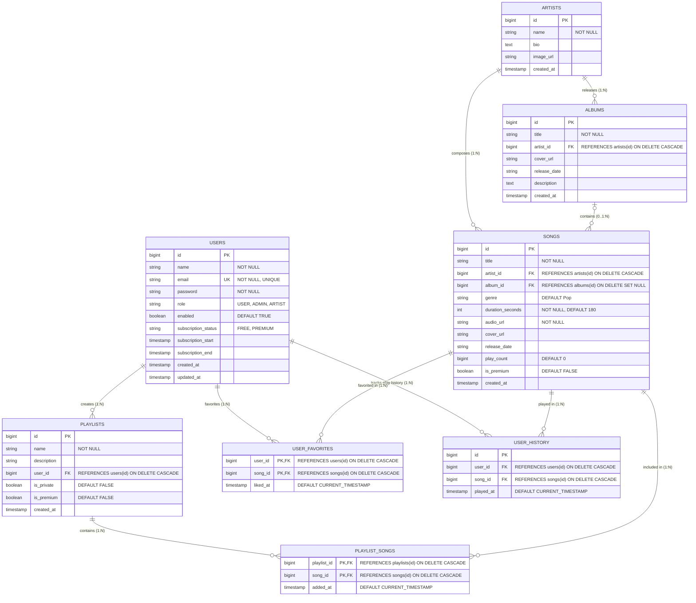

# PlayX Music Streaming Platform — Database ER Diagram & Architecture Documentation

This document provides a comprehensive Entity-Relationship (ER) diagram, detailed entity specifications, relational schemas, foreign key dependencies, cardinalities, and index mapping for the **PlayX Music Streaming Platform** database.

---

## 1. Visual Entity-Relationship (ER) Diagram

---

## 2. Entity & Table Specifications

### 2.1 `users`
Stores user profile information, authentication credentials, system roles, and subscription status.

| Column | Type | Constraints | Description |
| :--- | :--- | :--- | :--- |
| `id` | `BIGSERIAL` | `PRIMARY KEY` | Unique identifier for each user |
| `name` | `VARCHAR(100)` | `NOT NULL` | Full name of the user |
| `email` | `VARCHAR(255)` | `NOT NULL, UNIQUE` | User login email address |
| `password` | `VARCHAR(255)` | `NOT NULL` | BCrypt encrypted password hash |
| `role` | `VARCHAR(20)` | `NOT NULL, DEFAULT 'USER'` | User role (`USER`, `ADMIN`, `ARTIST`) |
| `enabled` | `BOOLEAN` | `NOT NULL, DEFAULT TRUE` | Active/Disabled status flag |
| `subscription_status` | `VARCHAR(20)` | `NOT NULL, DEFAULT 'FREE'` | Plan tier (`FREE`, `PREMIUM`) |
| `subscription_start` | `TIMESTAMPTZ` | Nullable | Premium subscription activation date |
| `subscription_end` | `TIMESTAMPTZ` | Nullable | Premium subscription expiry date |
| `created_at` | `TIMESTAMPTZ` | `NOT NULL, DEFAULT CURRENT_TIMESTAMP` | Account creation timestamp |
| `updated_at` | `TIMESTAMPTZ` | `NOT NULL, DEFAULT CURRENT_TIMESTAMP` | Profile last update timestamp |

---

### 2.2 `artists`
Stores musical artists/creators featured in the streaming catalog.

| Column | Type | Constraints | Description |
| :--- | :--- | :--- | :--- |
| `id` | `BIGSERIAL` | `PRIMARY KEY` | Unique identifier for each artist |
| `name` | `VARCHAR(100)` | `NOT NULL` | Stage/Artist name |
| `bio` | `TEXT` | Nullable | Biography and artist background |
| `image_url` | `VARCHAR(500)` | Nullable | Profile/Avatar image URL |
| `created_at` | `TIMESTAMPTZ` | `DEFAULT CURRENT_TIMESTAMP` | Record creation timestamp |

---

### 2.3 `albums`
Stores music albums released by artists.

| Column | Type | Constraints | Description |
| :--- | :--- | :--- | :--- |
| `id` | `BIGSERIAL` | `PRIMARY KEY` | Unique identifier for each album |
| `title` | `VARCHAR(150)` | `NOT NULL` | Album title |
| `artist_id` | `BIGINT` | `FK -> artists(id) ON DELETE CASCADE` | Associated artist ID |
| `cover_url` | `VARCHAR(500)` | Nullable | Album artwork cover URL |
| `release_date` | `VARCHAR(20)` | `DEFAULT '2024-01-01'` | Album release date string |
| `description` | `TEXT` | Nullable | Album summary or linear notes |
| `created_at` | `TIMESTAMPTZ` | `DEFAULT CURRENT_TIMESTAMP` | Record creation timestamp |

---

### 2.4 `songs`
Stores track meta-information, audio assets, metrics, and premium gating flags.

| Column | Type | Constraints | Description |
| :--- | :--- | :--- | :--- |
| `id` | `BIGSERIAL` | `PRIMARY KEY` | Unique identifier for each song |
| `title` | `VARCHAR(150)` | `NOT NULL` | Song title |
| `artist_id` | `BIGINT` | `FK -> artists(id) ON DELETE CASCADE` | Performing artist ID |
| `album_id` | `BIGINT` | `FK -> albums(id) ON DELETE SET NULL` | Parent album ID (optional single release if NULL) |
| `genre` | `VARCHAR(50)` | `DEFAULT 'Pop'` | Music genre category |
| `duration_seconds` | `INT` | `NOT NULL, DEFAULT 180` | Audio length in seconds |
| `audio_url` | `VARCHAR(500)` | `NOT NULL` | Streaming audio file URL (MP3/AAC) |
| `cover_url` | `VARCHAR(500)` | Nullable | Song artwork image URL |
| `release_date` | `VARCHAR(20)` | `DEFAULT '2024-01-01'` | Release date string |
| `play_count` | `BIGINT` | `DEFAULT 0` | Total play/listen count |
| `is_premium` | `BOOLEAN` | `DEFAULT FALSE` | Flag for Premium subscription access requirement |
| `created_at` | `TIMESTAMPTZ` | `DEFAULT CURRENT_TIMESTAMP` | Record creation timestamp |

---

### 2.5 `playlists`
Stores user-created or system-curated playlists.

| Column | Type | Constraints | Description |
| :--- | :--- | :--- | :--- |
| `id` | `BIGSERIAL` | `PRIMARY KEY` | Unique identifier for each playlist |
| `name` | `VARCHAR(150)` | `NOT NULL` | Playlist title |
| `description` | `VARCHAR(500)` | Nullable | Short description |
| `user_id` | `BIGINT` | `FK -> users(id) ON DELETE CASCADE` | Owner user ID (NULL for sample/system playlists) |
| `is_private` | `BOOLEAN` | `DEFAULT FALSE` | Visibility flag (Private vs Public) |
| `is_premium` | `BOOLEAN` | `DEFAULT FALSE` | Exclusive premium playlist flag |
| `created_at` | `TIMESTAMPTZ` | `DEFAULT CURRENT_TIMESTAMP` | Playlist creation timestamp |

---

### 2.6 `playlist_songs` *(Junction Table — Many-to-Many)*
Associates songs with playlists in a many-to-many relationship.

| Column | Type | Constraints | Description |
| :--- | :--- | :--- | :--- |
| `playlist_id` | `BIGINT` | `PK, FK -> playlists(id) ON DELETE CASCADE` | Target playlist ID |
| `song_id` | `BIGINT` | `PK, FK -> songs(id) ON DELETE CASCADE` | Included song ID |
| `added_at` | `TIMESTAMPTZ` | `DEFAULT CURRENT_TIMESTAMP` | Timestamp when song was added to playlist |

---

### 2.7 `user_favorites` *(Junction Table — Many-to-Many)*
Stores user liked/favorited tracks.

| Column | Type | Constraints | Description |
| :--- | :--- | :--- | :--- |
| `user_id` | `BIGINT` | `PK, FK -> users(id) ON DELETE CASCADE` | User who favorited the track |
| `song_id` | `BIGINT` | `PK, FK -> songs(id) ON DELETE CASCADE` | Favorited song ID |
| `liked_at` | `TIMESTAMPTZ` | `DEFAULT CURRENT_TIMESTAMP` | Timestamp when liked |

---

### 2.8 `user_history`
Logs playback history for analytics, user history view, and recommendation algorithms.

| Column | Type | Constraints | Description |
| :--- | :--- | :--- | :--- |
| `id` | `BIGSERIAL` | `PRIMARY KEY` | Unique history record ID |
| `user_id` | `BIGINT` | `FK -> users(id) ON DELETE CASCADE` | Listening user ID |
| `song_id` | `BIGINT` | `FK -> songs(id) ON DELETE CASCADE` | Played song ID |
| `played_at` | `TIMESTAMPTZ` | `DEFAULT CURRENT_TIMESTAMP` | Timestamp when track was played |

---

## 3. Relationships & Cardinalities Summary

| Source Entity | Target Entity | Relationship Type | Junction/Foreign Key | On Delete Behavior |
| :--- | :--- | :--- | :--- | :--- |
| **`artists`** | **`albums`** | 1 to Many (`1:N`) | `albums.artist_id` | `CASCADE` |
| **`artists`** | **`songs`** | 1 to Many (`1:N`) | `songs.artist_id` | `CASCADE` |
| **`albums`** | **`songs`** | 0..1 to Many (`0..1:N`) | `songs.album_id` | `SET NULL` |
| **`users`** | **`playlists`** | 1 to Many (`1:N`) | `playlists.user_id` | `CASCADE` |
| **`playlists`** | **`songs`** | Many to Many (`N:M`) | `playlist_songs(playlist_id, song_id)` | `CASCADE` |
| **`users`** | **`songs`** (Favorites) | Many to Many (`N:M`) | `user_favorites(user_id, song_id)` | `CASCADE` |
| **`users`** | **`user_history`** | 1 to Many (`1:N`) | `user_history.user_id` | `CASCADE` |
| **`songs`** | **`user_history`** | 1 to Many (`1:N`) | `user_history.song_id` | `CASCADE` |

---

## 4. Performance Indexes

| Table | Index Name | Indexed Columns | Purpose |
| :--- | :--- | :--- | :--- |
| `users` | `idx_users_email` | `email` | Fast authentication & login lookup |
| `artists` | `idx_artists_name` | `name` | Quick artist name search & autocomplete |
| `albums` | `idx_albums_title` | `title` | Album search performance |
| `songs` | `idx_songs_title` | `title` | Song title search performance |
| `songs` | `idx_songs_artist` | `artist_id` | Efficient filtering of songs by artist |
| `songs` | `idx_songs_genre` | `genre` | Fast genre filtering and recommendations |
| `playlists` | `idx_playlists_user` | `user_id` | Fast retrieval of user playlists |
| `user_history` | `idx_history_user` | `user_id` | Rapid user listening history retrieval |
